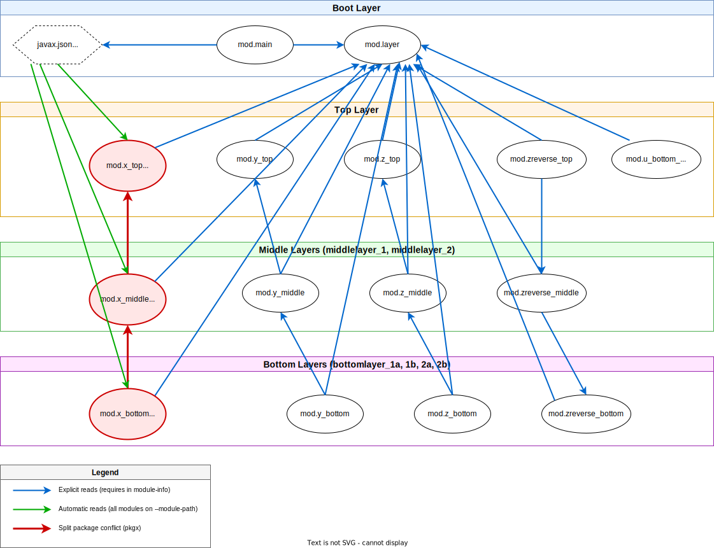

:icons: font
ifdef::env-github[]
:tip-caption: :bulb:
:note-caption: :information_source:
:important-caption: :heavy_exclamation_mark:
:caution-caption: :fire:
:warning-caption: :warning:
endif::[]
== Example example_layer-hierarchy

Part of the full xref:../../README.adoc[Java 9 Jigsaw modules example] suite.

[IMPORTANT]
.Authors
====
Originally written by https://github.com/mrtnlhmnn[Martin Lehmann], https://github.com/kristines[Kristine Schaal] and https://github.com/rgrammes[Rüdiger Grammes] (cf. https://github.com/accso/java9-jigsaw-examples[original repository]).

Migrated for JPMS support documentation of Apache Maven^TM^ in the course of the https://open-elements.com/support-care-maven/[Maven Support & Care] program by https://github.com/ascheman[Gerd Aschemann] (and other team members) as https://github.com/support-and-care/java9-jigsaw-examples[forked repository].
Please add discussions, requirements, bugfixes, etc. to the fork instead of the original.
====

== What is this example about?

=== Layers in this example

The layer hierarchy as persisted in `layers_triple_hierarchy.json` defines the following layer structure:

* layer `toplayer` on level top (parent is the boot layer)
** layer `middlelayer_1` on level middle (parent is `toplayer`)
*** layer `bottomlayer_1a` on level bottom (parent is `middlelayer_1`)
*** layer `bottomlayer_1b` on level bottom (parent is `middlelayer_1`)
** layer middlelayer_2` on level middle (parent is toplayer)
*** layer `bottomlayer_2a` on level bottom (parent is `middlelayer_2`)
*** layer `bottomlayer_2b` on level bottom (parent is `middlelayer_2`)

=== Modules in this example

* `mod.layer` contains a layer tree data structure (built up when reading a JSON file like `layers_triple_hierarchy.json`)
* `mod.main` contains the main class which
.. builts up the layers and
.. calls the `doIt()` in all modules in all layers

All other modules are put automatically to a Jigsaw layer based on their naming convention (module name's suffix matches layer level).
See `modmain/pkgmain.LayerBuilder.java`:

* `mod.x_bottom` (in layer bottom), `mod.x_middle` (in layer middle), `mod.x_top` (in layer top) all have the same package (`pkgx`) and same class name.
** At runtime, the split package problem does not occur because these modules are loaded in different layers - each layer has its own instance of `pkgx`.
** However, at compile time, a split package problem occurs due to the automatic module `javax.json` (see explanation below).
* `mod.y_bottom` (in layer bottom), `mod.y_middle` (in layer middle), `mod.y_top` (in layer top) use different packages.
** A class in bottom is derived from one in middle which is derived from top.
* `mod.z_bottom` (in layer bottom), `mod.z_middle` (in layer middle), `mod.z_top` (in layer top) use different packages.
** Similar to the `Y` example except that the `Z*` classes are not derived from each other but use delegation (from bottom->middle, from middle->top).
* `mod.zreverse_bottom` (in layer top), `mod.zreverse_middle` (in layer top), `mod.zreverse_top` (in layer top) use different packages.
** Similar to the `Z` example except that the order is "reversed".
Because of that, _all_ modules already end up in the top layer, because top requires middle which requires bottom.
* `mod.u_bottom_middle_top` (in layer top) is a module, which could theoretically end up in all layers but is already resolved in top layer.

=== Understanding the "Reads" Relationship and Split Package Problem

==== JPMS "Reads" Semantics

In the Java Platform Module System (JPMS), when module A "reads" module B, it means:

* Module A has access to all packages that module B _exports_
* This is established via `requires` declarations in `module-info.java` for explicit modules
* For _automatic modules_ (JARs without `module-info.java` on the module-path), the rules are different:
** An automatic module automatically _reads ALL modules_ on the module-path (both explicit and automatic)
** An automatic module automatically _exports all its packages_

==== The `javax.json` Automatic Module Problem

In this example:

* `mod.main` declares `requires javax.json` to read the JSON configuration file
* `javax.json` is placed in `amlib/` as an automatic module (JAR without `module-info.java`)
* Because `javax.json` is automatic, it automatically reads _all modules on the module-path_, including:
** `mod.x_bottom` (exports `pkgx`)
** `mod.x_middle` (exports `pkgx`)
** `mod.x_top` (exports `pkgx`)

==== Compile-Time vs. Runtime Behavior

*At Compile Time:*

* All modules are on the `--module-path`: `mlib` (application modules) + `amlib` (javax.json)
* The compiler sees that `javax.json` reads three modules that all export the same package `pkgx`
* This violates the JPMS rule: "A module cannot read two modules that export the same package"
* *Result:* Compilation fails with a split package error

*Workaround:* The `mod.x_*` modules must be compiled _separately_ (see compile.sh lines 7-14), so they are never all on the module-path simultaneously when `javax.json` is present.

*At Runtime:*

* Modules are loaded into _different layers_ according to their names (`_bottom`, `_middle`, `_top`)
* Each layer maintains its own module namespace
* The same package `pkgx` can exist in multiple layers without conflict
* `javax.json` is only in the boot layer and only "sees" modules in the boot layer at runtime
* *Result:* No split package problem occurs - each layer has its own isolated instance of `pkgx`

[NOTE]
====
This demonstrates an important aspect of JPMS: _layer isolation at runtime_ provides stronger encapsulation than what's possible at compile time with automatic modules.
The compile-time restriction is necessary because automatic modules have automatic reads to all modules, but at runtime, layers provide the isolation needed to avoid conflicts.

For more details, see this https://mail.openjdk.java.net/pipermail/jigsaw-dev/2016-September/009290.html[discussion in the jigsaw-dev mailing list].
====

=== Example shows ...

. The example shows how a layer hierarchy can be built up (see `mod.main/pkgmain.LayerBuilder` and `mod.layers/pkglayer.*.java`, in the Jigsaw boot layer)
** For that hierarcy, we use a tree of layers in our own tree/composite-pattern data structure (see `mod.layer`).
Each of the tree nodes has a name, a level and keeps the reference to a Jigsaw layer.
** This layer tree hierarchy is read from a JSON file.
** Each name of a layer tree node must be globally unique.
** Modules (`mod.u*`, `mod.x*`, `mod.y*`, `mod.z*`) are added to the layers (see section "Modules ..." above).
. The example shows also how modules in different layers can interact with each other via derivation and delegation (see section "Modules ...").
. Finally, the examples shows how one can call any other class in any other module in the layer hierarchy via reflection (see `mod.main/pkgmain.ModuleCaller`, in the Jigsaw boot layer).

[[sec:maven-4-migration]]
=== Maven 4 Migration

This example has been migrated to Maven 4 using the Module Source Hierarchy layout with symbolic links to the original source directories.

==== Migration Challenges

The primary challenge in this migration is the *split package problem at compile time* caused by the automatic module `javax.json`.

*The Problem:*

* Three modules (`mod.x_bottom`, `mod.x_middle`, `mod.x_top`) all export package `pkgx`
* At runtime, this works fine because modules are loaded into different layers (layer isolation)
* At compile time, the automatic module `javax.json` automatically reads _all_ modules on the module-path
* This creates a compile-time conflict: `javax.json` would read three modules exporting the same package

==== Migration Approach

The Maven 4 migration uses a *hybrid compilation strategy*:

*Phase 1 - Manual compilation of mod.x modules:*

The `compile.sh` script manually compiles the three `mod.x_*` modules separately using `javac` to avoid having them all on the module-path simultaneously.

[source,bash]
----
# Compile mod.x_* modules separately (split package problem with automatic module)
for mod in mod.x_bottom mod.x_middle mod.x_top; do
  javac -d mods/${mod} --module-path amlib --module-source-path "../src" -m ${mod}
  jar --create --file=mlib/${mod}.jar -C mods/${mod}/${mod} .
done
----

*Phase 2 - Maven compilation of remaining modules:*

Maven 4 compiles all other modules (`mod.main`, `mod.layer`, `mod.y_*`, `mod.z_*`, etc.) using the Module Source Hierarchy.

==== Technical Implementation

*Symbolic link structure:*

The migration uses symbolic links from `m4/src/<module>/main/java` to `../../../../src/<module>`:

[source,bash]
----
m4/src/mod.main/main/java -> ../../../../src/mod.main
m4/src/mod.layer/main/java -> ../../../../src/mod.layer
m4/src/mod.y_bottom/main/java -> ../../../../src/mod.y_bottom
... (and all other non-x modules)
----

These symbolic links are *checked into Git* and do not need to be created dynamically.

*pom.xml configuration:*

The `pom.xml` uses Maven 4.1.0 model and declares all modules except the `mod.x_*` modules (which are compiled manually):

[source,xml]
----
<sources>
  <source>
    <module>mod.main</module>
    <directory>src/mod.main/main/java</directory>
  </source>
  <source>
    <module>mod.layer</module>
    <directory>src/mod.layer/main/java</directory>
  </source>
  <!-- ... all other modules except mod.x_* ... -->
</sources>
----

*Dependency on automatic module:*

The automatic module `javax.json` is downloaded via `maven-dependency-plugin` to `amlib/`:

[source,xml]
----
<plugin>
  <artifactId>maven-dependency-plugin</artifactId>
  <executions>
    <execution>
      <id>copy-dependencies</id>
      <goals>
        <goal>copy-dependencies</goal>
      </goals>
      <configuration>
        <outputDirectory>${project.build.directory}/../amlib</outputDirectory>
      </configuration>
    </execution>
  </executions>
</plugin>
----

==== Running the Maven 4 Version

[source,bash]
----
cd m4/
./compile.sh  # Hybrid: manual javac for mod.x_*, Maven for others
./run.sh      # Run the layer hierarchy example
./verify.sh   # Verify output matches expected result
./clean.sh    # Remove build artifacts
----

=== Output

This example uses xref:../../README.adoc#golden-master-testing[golden master testing] to ensure output consistency.
The expected output is compared with actual output using `verify.sh`.

==== Expected Output

[source]
----
include::expected-result/run.txt[]
----

==== Actual Output

[source]
----
include::run-result/run.txt[]
----

==== Maven 4 Output

[source]
----
include::m4/run-result/run.txt[]
----
